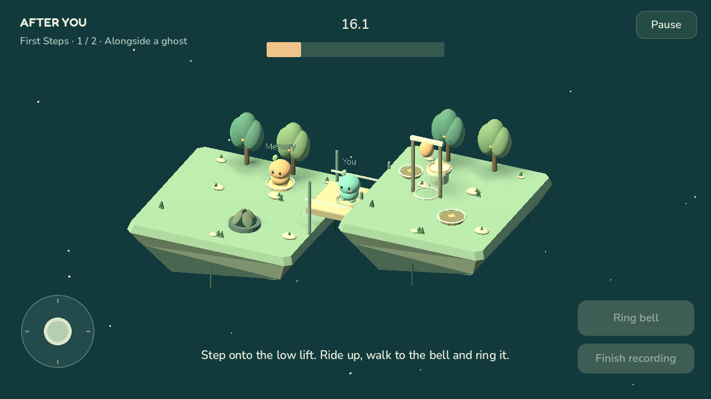
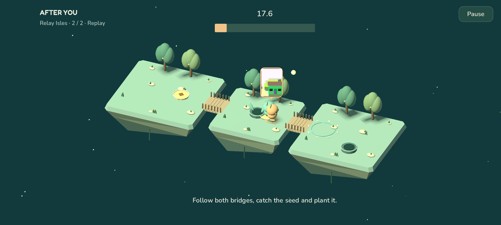
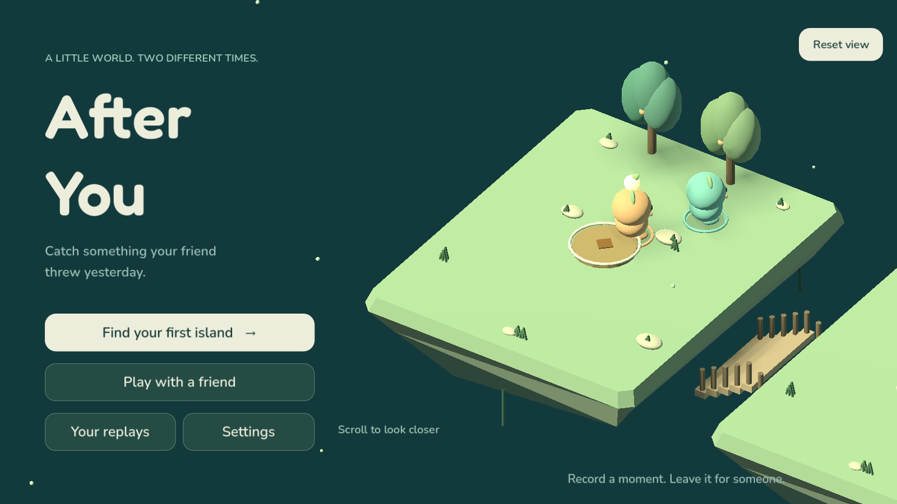
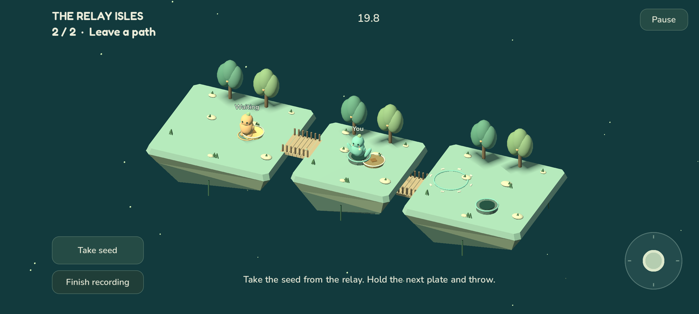
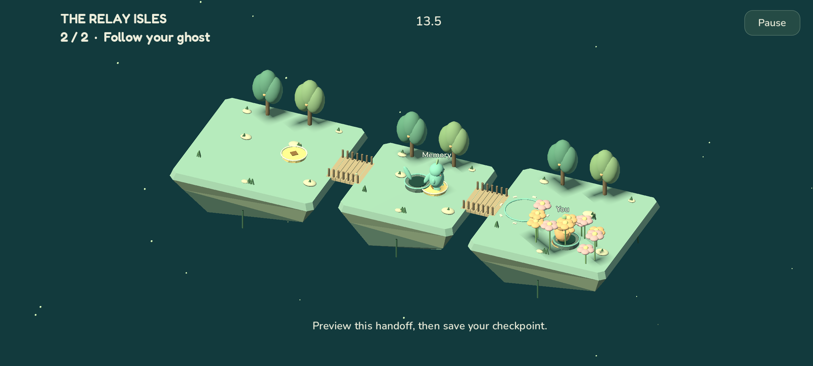
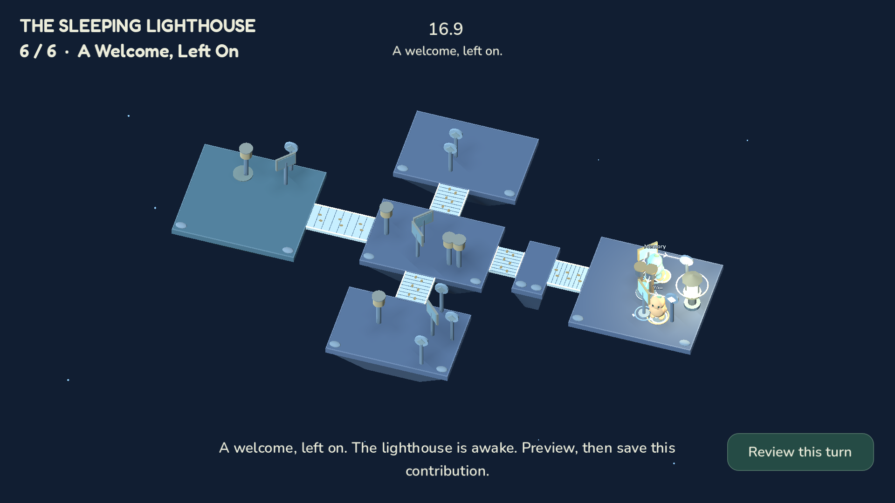

# After You

**Catch something your friend threw yesterday.**

After You is an Android cooperative puzzle game for two people playing at different
times. Leave a short recording in a floating world; your friend returns later to
move beside your ghost and finish what you started.

Begin with **First Steps**, two connected tasks in one world. Power a lift so your
friend can ride to the loft and ring its bell. Then swap roles: pass a glowing seed
downstairs and open the garden for your partner to plant it. A checkpoint keeps both
spirits where they finished. Solo practice lets one person play both parts.



*First Steps, captured from the native Godot project on desktop.*

Screenshots show the Android app running in an emulator unless a caption says otherwise.

## Play

[Download an APK from the test releases](https://github.com/aamir-azeez/after-you/releases),
or browse the [release notes and earlier builds](https://github.com/aamir-azeez/after-you/releases).
Each release includes a SHA-256 checksum. Both players install the app. The source
targets Android 7.0/API 24 and later, with arm64 and x86-64 builds.
See each release's notes for its included features.

1. Choose **Find your first island → Start First Steps** to practice both parts.
2. Move with the thumbstick. The action button names the nearby action and becomes
   available when you can use it.
3. Record up to 20 seconds, preview your contribution, then save it. The next
   spirit plays beside that recording. Saving both parts completes a stage.
4. To play together, choose **First Steps with a friend** on the journey screen.
   Create a room and share its invitation code. Your friend enters it under
   **Play with a friend → Join a chapter**.

Neither player needs to stay online while the other records. Saved stages can be
revisited as combined replays. **Play with a friend → Choose an online chapter**
also offers First Steps and Relay Isles.

Forgiving catches are enabled initially. Settings include reduced motion,
left-handed controls, sound and haptics. Desktop development uses WASD/arrow keys,
Space for the context action and Escape to pause; the player build is Android.

### Optional photo memories

After saving an online First Steps or Relay Isles contribution, you can add a tiny
photo. Take or retake it, choose **Use photo**, then **Share photo with this room**.
Use keeps the image on your device; Share sends it to your friend. After confirmation,
choose **Done — continue playing**. **Keep on device & continue** saves the photo
in app-private storage without uploading it. Kept and downloaded photos no longer
expire from the camera cache.
**Continue without a photo** lets you skip it.

Each contribution keeps its own photo. During a combined replay, the bubble above
each spirit changes to the photo for that person's contribution in the current
stage, including when the recording roles swap. A turn without a photo has no
bubble; it does not borrow that person's latest photo. A shared photo downloads
when first needed and is verified and saved on the phone. Later replays reuse its
local pixels; small metadata checks detect replacements and removals. Cached
photos remain viewable offline. Automatic delivery cleanup removes a shared image
after both players acknowledge that its exact version is safely stored on their
phones. Explicit photo, room or account deletion can also remove server copies.

**Shared replays** on the home screen collects cooperative memories separately
from **Your replays**. Open a room and choose a completed stage to watch both
contributions together. Previously cached memories can be viewed offline; opening
an older uncached memory requires a connection.

Before changing phones, open **Settings → Account & recovery → Photo transfer**.
Preparing a transfer explicitly uploads up to the newest 1,000 saved photos,
including unshared photos, to temporary private account storage. Recover the same
account on the other phone, then choose **Receive photos**. Receiving removes each
server copy after its bytes and metadata have been saved and verified locally.
Temporary copies expire after 14 days; a new transfer can be prepared once every
24 hours. Temporary storage retains up to the newest 1,000 photos. Interrupted
requests retain their progress. Capacity limits can stop a transfer before all
selected photos upload; the app explains when to retry, and local photos are kept.
Reinstalling or clearing app data
removes local photos, so prepare a transfer before doing so.

New captures are square, at most 160 × 160 pixels and 24 KiB. Older photos remain
readable. You can reopen your contribution's photo to share or remove it without
changing the recorded turn. Disable prompts with **Don't ask after each turn**, or
change **Offer a photo after each shared turn** in Settings.



*An Android emulator capture after an explicit Share. The image comes from the
emulator's virtual camera; it is not a physical-phone selfie.*

The Android robot in the virtual-camera image is artwork by Google, reproduced
under the [Creative Commons Attribution 3.0 license](https://creativecommons.org/licenses/by/3.0/).
See [Android's attribution guidelines](https://developer.android.com/distribute/marketing-tools/brand-guidelines).
Android is a trademark of Google LLC.

### A little closer

Pinch on the home island to look closer at the wandering spirits; on desktop,
use the mouse wheel. **Reset view** returns to the original framing. Game controls
and puzzle recordings are independent of this menu view. Footsteps are quiet,
rounded taps, and the Sound setting silences them.



*Desktop Godot capture of the home island.*

### Relay Isles

Three islands, two bridges and a relay socket make a longer crossing. Save the
first pair of contributions at the middle island, swap roles, then carry the seed
to the far garden. Both stages replay as one memory. Rehearsals and checkpoints
survive closing the app.

Choose **Relay Isles · Solo** or **Relay Isles · Together** on the journey screen.
The two spirits keep their colors when their recording roles swap. Solo saves and
shared chapter rooms remain separate from the earlier eight-island journey.



*The same three-island world continues after the checkpoint. Left-handed controls
are shown.*

<details>
<summary>After the online handoff</summary>



*An Android emulator capture of the completed online handoff.*

</details>

### The Sleeping Lighthouse · Solo

Six saved stages connect a group of islands: redirect a beam, replace a missing
lens, align two signals, leave timed crossings, hand off the same lens and wake
the lighthouse together. Each stage alternates the two contributions and keeps
a checkpoint. Rehearse either part, preview it before saving, and replay the
completed chapter. This solo chapter is included in the one-time **Full Journey**
unlock. Choose it from the journey screen to see the current store price, purchase
or restore access. Previously saved Lighthouse progress is kept.



*Desktop Godot capture. The ending stays visible until the player chooses to review
the turn.*

### Earlier islands

The original eight islands remain under **Earlier islands**, including their saved
progress and replays. They introduce charged bridges, a second plate and rising
gardens. Use **Earlier islands · online** or **Join an earlier island** for these
older shared rooms; chapter invitations use **Join a chapter** instead. Existing
rooms and recordings keep their original versions.


*Across the Blue: leave the crossing open, move to the second plate, and let your
friend return to finish the garden.*

<details>
<summary>Revisit your shared journey</summary>


Both players can return to completed islands and watch their contributions together.

</details>

### Access, purchases and multiplayer

First Steps and Relay Isles are free chapters. **Full Journey** is a one-time
unlock for all six solo Lighthouse stages and the five premium earlier islands.
The first three earlier islands are also free. A friend joining the purchaser's
hosted earlier-island room does not need a second purchase; Lighthouse is solo.
Development APKs labelled **Test Store** use RevenueCat's simulated checkout.
Google Play builds use Google Play Billing through RevenueCat.

Invited testers can redeem an access code under **Settings → Tester code**.
Redeemed access remains available offline. After recovering the same game account
on another device, choose **Restore tester access**.

Waiting rooms check for updates about every three seconds while open, with manual
refresh and longer intervals after connection failures. Configured Android builds
offer optional **Settings → Notifications** for a nudge when a friend leaves a turn.
Notification delivery requires Android permission and a connection; manual refresh
remains available. Opening a notification checks the shared room and preserves any
unfinished rehearsal before switching rooms. Completed earlier-island rooms offer
preset reaction messages. First Steps and Relay Isles support optional turn photos;
their current app UI does not yet offer preset messages. The Sleeping Lighthouse
is a solo chapter.

## Build the Android app

The native toolchain is pinned to Godot **4.7.2 stable**, its matching Android export
templates and JDK 17. Both the Godot Android export and native plugin compile with
SDK platform 36 and target API 36. The plugin uses Gradle 8.11.1, Android
Gradle Plugin 8.9.2, Kotlin 2.1.20 and RevenueCat Android SDK 10.15.1. Gradle wrapper
downloads have a pinned SHA-256 checksum.

On Windows, run the build script from PowerShell with the locations of your tools:

```powershell
.\scripts\build-android.ps1 -Configuration Debug `
  -GodotExe 'C:\Tools\Godot\Godot_v4.7.2-stable_win64_console.exe' `
  -JdkPath 'C:\Tools\jdk-17' `
  -AndroidSdk 'C:\Tools\android-sdk' `
  -PrivateRoot 'C:\Builds\AfterYou-private'
```

`PrivateRoot` must be outside the repository. It contains signing keys, encrypted
signing passwords and deliverable APKs. Keep its signing backup: future updates
must use the same key. `-Configuration Release` creates a separate release key on
first use. An incomplete key/password pair stops the build instead of being replaced.
RevenueCat Test Store requires a debuggable app, so the current configuration exports
**After You - Test Store.apk** with `Debug`. Each build writes into a unique
`deliverables/candidates/<run>/` directory, preserving previously shared APKs.
An optional `-OutputPath` may select a new APK path inside that candidates directory;
existing files, redirected directories and paths outside it are rejected before building.
The build rejects a Test Store key in a
production `Release`; configure the real platform store before making that variant.

The script builds the native AAR, installs the Godot Android source template,
imports the project, exports the APK and verifies its signing certificate. Generated
Android projects, AARs and build caches are excluded from version control. See
[native integration](native/README.md) for the plugin API and device-specific tests.

Run `./scripts/test-android-artifacts.ps1` to check the build script's output-path
protections without compiling an Android build.

The runtime configuration is `game/app_config.json`. It contains only the public
API URL, RevenueCat **public SDK key** and explicit purchase mode. The backend's
RevenueCat secret key belongs in its environment secrets, never this file or APK.
For notifications, add `-FirebaseConfigPath` with an absolute path to the Android
app's `google-services.json` outside the repository. The build embeds only its four
public Firebase resources and checks that both native libraries and the APK match.
The server's messaging credential remains a Worker secret. Without this optional
build configuration, notifications are unavailable and the rest of the game works.
See [native notifications](native/NOTIFICATIONS.md) for setup and validation.

To try an APK over ADB after the device has authorized USB or wireless debugging:

```text
adb install -r "After You - Test Store.apk"
adb shell monkey -p com.aamirazeez.afteryou 1
```

## Run the checks

Using the pinned Godot executable on your path, run these checks from the
repository root. The [verification workflow](.github/workflows/verify.yml) lists
the full suite, including Relay Isles, Lighthouse and online chapter checks:

```text
godot --headless --editor --path game --import
godot --headless --path game --script res://tests/test_first_steps.gd
godot --headless --path game --script res://tests/test_first_steps_lift_continuity.gd
godot --headless --path game --script res://tests/test_first_steps_preview.gd
godot --headless --path game --script res://tests/test_chapter_settings_compatibility.gd
godot --headless --path game --script res://tests/test_replay_photo_contributions.gd
godot --headless --path game --script res://tests/test_photo_open_wait.gd
godot --headless --path game --script res://tests/test_refresh_schedule.gd
godot --headless --path game --script res://tests/test_home_stage.gd
godot --headless --path game --script res://tests/test_simulation.gd
godot --headless --path game --script res://tests/test_app_state.gd
godot --headless --path game --script res://tests/test_lifecycle.gd
godot --headless --path game --script res://tests/test_completion_moment.gd
godot --headless --path game --script res://tests/test_layout.gd
godot --headless --path game --script res://tests/test_room_layout.gd
godot --headless --path game --script res://tests/test_safe_area.gd
godot --headless --path game --script res://tests/test_settings.gd
godot --headless --path game --script res://tests/test_spirit_motion.gd
godot --headless --path game --script res://tests/test_recovery_copy.gd
godot --headless --path game --script res://tests/test_recovery_details.gd
godot --headless --path game --script res://tests/test_recovery_import.gd
godot --headless --path game --script res://tests/test_license_catalog.gd
godot --headless --path game --script res://tests/test_licenses.gd
godot --headless --path game --script res://tests/test_soundscape.gd
godot --headless --path game --script res://tests/test_audio_integration.gd
```

First Steps checks cover both tasks, lift checkpoint continuity and preview flow.
Chapter compatibility checks load older default-settings envelopes without changing
their saved proof or draft. Photo checks cover distinct contributions across role
swaps, delayed responses and safely reopening the editor. Refresh and home checks
cover scheduling and camera gestures.

The original simulation suite solves all eight earlier islands and verifies replay determinism,
misses, mechanism requirements, source integrity and version handling. The app-state
suite tests interrupted save recovery, unknown future saves, preview/pause behavior,
store-offer interpretation and injected network failures with exact request retries.
The lifecycle suite checks background draft preservation, duplicate notifications,
safe deferred refreshes, late network responses and receipt-only reconciliation.
Layout checks cover both handedness settings, signed-in account controls and
shared rooms before, during and after a completed handoff.
Landscape checks exercise window expansion and display cutouts. Repeated setting
changes verify visual states and persistence; locomotion checks cover both spirits,
replay outcomes, turning, idle settling and reduced motion.
Recovery copy checks cover explicit action, stale credentials, native errors and
feedback that never displays the copied codes.
Audio checks cover imported loop lengths, saved mute, background transitions,
single event delivery, silent draft reconstruction and replay haptic suppression.
Transport test doubles are confined to `game/tests` and excluded from Android exports.

Backend checks run in the Workers runtime:

```text
cd backend
npm ci
npm run check
```

See [the backend guide](backend/README.md) for local operation, deployment, room
contracts and service smoke checks.

## How it works

- `game/core` owns the 30 Hz integer simulation, versioned islands and replay validation.
- `game/presentation` owns 3D scenery, animation and touch controls.
- `game/services` owns durable local saves, purchase integration, encrypted identity
  access and room transport.
- `native` wraps the official RevenueCat Android SDK and Android Keystore.
- `backend` uses Cloudflare Workers and SQLite Durable Objects for players, rooms,
  private photo transfers and a shared transfer-admission ledger.

Recordings contain compact actions and state checkpoints, not screen video.
Critical puzzle objects use scripted trajectories rather than unrestricted physics.
Earlier contributions are immutable; a new attempt invalidates dependent later turns.
Read [the core guide](game/core/README.md) before changing recording or simulation versions.

Online identities are anonymous. Invitation codes admit a friend to a room; recovery
codes recover the identity and must be kept private. Device credentials stay in
encrypted, non-backed-up Android storage. Identity deletion removes associated shared
rooms for both participants. It does not refund a store purchase. Local solo progress
remains on the device.

Drafts and pending submissions are saved before network requests. An uncertain request
keeps its exact body and idempotency key until a receipt is reconciled. Conflicting
recordings are preserved for review instead of silently overwriting the partner's turn.

## License

Application source is available under the [MIT license](LICENSE). External libraries,
fonts and other attributed assets retain their own licenses; retain those notices
when redistributing the app.

The procedural scenery and synthesized audio are original application assets under
the same MIT license. Regenerate the eight audio clips with Python 3 and
`python scripts/generate-audio.py`; the generator uses only the standard library.
The bundled Fredoka and Nunito fonts retain their accompanying OFL notices.
Settings → Licenses makes the bundled notices readable offline, including the
running engine's own component attributions. The Android export includes the
font OFLs and `game/assets/licenses/` text files. Refresh the native component
index and notices when changing Android runtime dependencies.
After exporting, run `python scripts/check-apk-notices.py path/to/AfterYou.apk`
to check that the APK contains the exact notice files from source.
