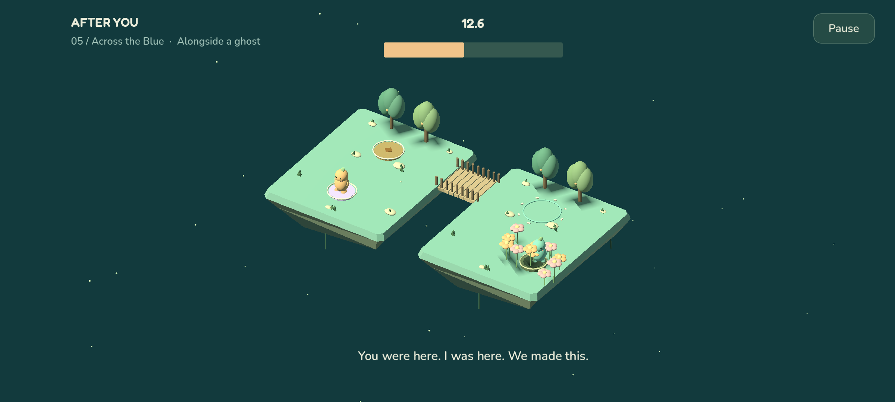
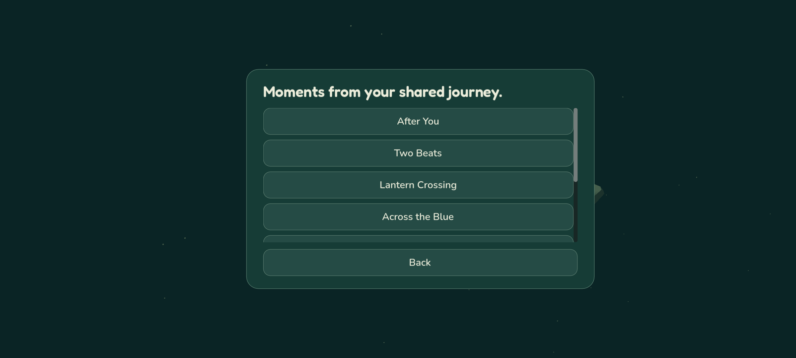

# After You

**Catch something your friend threw yesterday.**

After You is an Android cooperative puzzle game for two people playing at different
times. Leave a short recording on a floating island; your friend returns later to
cross the bridge beside your ghost, catch a glowing seed and make the garden bloom.

The eight-island journey introduces charged bridges, a second plate and rising
gardens. Solo practice lets one person play both parts. Recordings can be rehearsed,
previewed and saved; completed islands remain available as combined replays.



*Across the Blue: leave the crossing open, move to the second plate, and let your
friend return to finish the garden.*

<details>
<summary>Revisit your shared journey</summary>



Both players can return to completed islands and watch their contributions together.

</details>

Screenshots show the Android app running in an emulator.

## Play

Install the signed Android APK supplied with a release. Both players install the
app. The source targets Android 7.0/API 24 and later, with arm64 and x86-64 builds.

1. Choose **Find your first island** to practice the introductory scene.
2. Move with the thumbstick and use the context button to throw or plant.
3. As the first spirit, stand on the plate, throw and leave the route ready.
4. Preview the contribution before saving it. The next spirit crosses beside its ghost.
5. Choose **Play with a friend** to create an online room or join an invitation.

Forgiving catches are enabled initially. The settings include reduced motion and
left-handed control placement. Desktop development uses WASD/arrow keys, Space for
the context action and Escape to pause; the shipping player experience is Android.

Three islands are free. **Full Journey** is a one-time unlock for the remaining
five; a friend joining the purchaser's hosted room does not need a second purchase.
Test builds explicitly identify RevenueCat Test Store checkout. A Test Store
entitlement is not evidence of a real-money store sale.

### Relay Isles preview

The journey screen also offers a local preview of a larger chapter: three islands,
two bridges and a relay socket. Save the first pair of contributions at the middle
island, swap spirits, then carry the seed to the far garden. Both stages replay as
one memory. Rehearsals and checkpoints survive closing the app.

This preview currently runs in solo practice. It stores its progress separately
from the original eight-island journey and existing online rooms.

## Build the Android app

The native toolchain is pinned to Godot **4.7.2 stable**, its matching Android export
templates and JDK 17. The Godot Android export compiles with SDK platform 36 and
targets API 35; the native plugin compiles with SDK platform 35. Install both SDK
platforms required by those pinned builds. The plugin uses Gradle 8.11.1, Android
Gradle Plugin 8.9.2, Kotlin 2.1.20 and RevenueCat Android SDK 10.15.1. Gradle wrapper
downloads have a pinned SHA-256 checksum.

On Windows, run the build script from PowerShell with the locations of your tools:

```powershell
.\scripts\build-android.ps1 -Configuration Debug `
  -GodotExe 'C:\Tools\Godot\Godot_v4.7.2-stable_win64_console.exe' `
  -JdkPath 'C:\Tools\jdk-17' `
  -AndroidSdk 'C:\Tools\android-sdk' `
  -PrivateRoot 'C:\Builds\AfterYou-private'
```

`PrivateRoot` must be outside the repository. It contains signing keys, encrypted
signing passwords and deliverable APKs. Keep its signing backup: future updates
must use the same key. `-Configuration Release` creates a separate release key on
first use. An incomplete key/password pair stops the build instead of being replaced.
RevenueCat Test Store requires a debuggable app, so the current configuration exports
**After You - Test Store.apk** with `Debug`. Each build writes into a unique
`deliverables/candidates/<run>/` directory, preserving previously shared APKs.
An optional `-OutputPath` may select a new APK path inside that candidates directory;
existing files, redirected directories and paths outside it are rejected before building.
The build rejects a Test Store key in a
production `Release`; configure the real platform store before making that variant.

The script builds the native AAR, installs the Godot Android source template,
imports the project, exports the APK and verifies its signing certificate. Generated
Android projects, AARs and build caches are excluded from version control. See
[native integration](native/README.md) for the plugin API and device-specific tests.

Treat export/signature checks as build validation, not completed device testing.
Install the candidate as an update and check account, save, purchase and gameplay
behavior before distributing it. Keep the tested APK, SHA-256, source commit and
QA record together in a versioned directory outside the repository. Only then copy
that exact APK to a stable delivery filename. A failed build or test must leave the
previously distributed file intact. Check the output-path protections with
`./scripts/test-android-artifacts.ps1`; this does not run an Android build.

The runtime configuration is `game/app_config.json`. It contains only the public
API URL, RevenueCat **public SDK key** and explicit purchase mode. The backend's
RevenueCat secret key belongs in its environment secrets, never this file or APK.
An unconfigured service or unavailable native plugin leaves online rooms or
purchases unavailable; it does not simulate success.

To try an APK over ADB after the device has authorized USB or wireless debugging:

```text
adb install -r "After You - Test Store.apk"
adb shell monkey -p com.aamirazeez.afteryou 1
```

## Run the checks

Using the pinned Godot executable on your path, from the repository root:

```text
godot --headless --editor --path game --import
godot --headless --path game --script res://tests/test_simulation.gd
godot --headless --path game --script res://tests/test_app_state.gd
godot --headless --path game --script res://tests/test_lifecycle.gd
godot --headless --path game --script res://tests/test_completion_moment.gd
godot --headless --path game --script res://tests/test_layout.gd
godot --headless --path game --script res://tests/test_room_layout.gd
godot --headless --path game --script res://tests/test_safe_area.gd
godot --headless --path game --script res://tests/test_settings.gd
godot --headless --path game --script res://tests/test_spirit_motion.gd
godot --headless --path game --script res://tests/test_recovery_copy.gd
godot --headless --path game --script res://tests/test_recovery_details.gd
godot --headless --path game --script res://tests/test_recovery_import.gd
godot --headless --path game --script res://tests/test_license_catalog.gd
godot --headless --path game --script res://tests/test_licenses.gd
godot --headless --path game --script res://tests/test_soundscape.gd
godot --headless --path game --script res://tests/test_audio_integration.gd
```

The simulation suite solves all eight islands and verifies replay determinism,
misses, mechanism requirements, source integrity and version handling. The app-state
suite tests interrupted save recovery, unknown future saves, preview/pause behavior,
store-offer interpretation and injected network failures with exact request retries.
The lifecycle suite checks background draft preservation, duplicate notifications,
safe deferred refreshes, late network responses and receipt-only reconciliation.
Layout checks cover both handedness settings, signed-in account controls and
shared rooms before, during and after a completed handoff.
Landscape checks exercise window expansion and display cutouts. Repeated setting
changes verify visual states and persistence; locomotion checks cover both spirits,
replay outcomes, turning, idle settling and reduced motion.
Recovery copy checks cover explicit action, stale credentials, native errors and
feedback that never displays the copied codes.
Audio checks cover imported loop lengths, saved mute, background transitions,
single event delivery, silent draft reconstruction and replay haptic suppression.
Transport test doubles are confined to `game/tests` and excluded from Android exports.

Backend checks run in the Workers runtime:

```text
cd backend
npm ci
npm run check
```

See [the backend guide](backend/README.md) for local operation, deployment, room
contracts and actual-service smoke checks. These tests do not replace touch usability,
two-device play, real store interaction or performance measurements on Android.

## How it works

- `game/core` owns the 30 Hz integer simulation, versioned islands and replay validation.
- `game/presentation` owns 3D scenery, animation and touch controls.
- `game/services` owns durable local saves, purchase integration, encrypted identity
  access and room transport.
- `native` wraps the official RevenueCat Android SDK and Android Keystore.
- `backend` uses Cloudflare Workers and SQLite Durable Objects, one per player and room.

Recordings contain compact actions and state checkpoints, not screen video.
Critical puzzle objects use scripted trajectories rather than unrestricted physics.
Earlier contributions are immutable; a new attempt invalidates dependent later turns.
Read [the core guide](game/core/README.md) before changing recording or simulation versions.

Online identities are anonymous. Invitation codes admit a friend to a room; recovery
codes recover the identity and must be kept private. Device credentials stay in
encrypted, non-backed-up Android storage. Identity deletion removes associated shared
rooms for both participants. It does not refund a store purchase. Local solo progress
remains on the device.

Drafts and pending submissions are saved before network requests. An uncertain request
keeps its exact body and idempotency key until a receipt is reconciled. Conflicting
recordings are preserved for review instead of silently overwriting the partner's turn.

## License

Application source is available under the [MIT license](LICENSE). External libraries,
fonts and other attributed assets retain their own licenses; retain those notices
when redistributing the app.

The procedural scenery and synthesized audio are original application assets under
the same MIT license. Regenerate the eight audio clips with Python 3 and
`python scripts/generate-audio.py`; the generator uses only the standard library.
The bundled Fredoka and Nunito fonts retain their accompanying OFL notices.
Settings → Licenses makes the bundled notices readable offline, including the
running engine's own component attributions. The Android export includes the
font OFLs and `game/assets/licenses/` text files. Refresh the native component
index and notices when changing Android runtime dependencies.
After exporting, run `python scripts/check-apk-notices.py path/to/AfterYou.apk`
to check that the APK contains the exact notice files from source.
