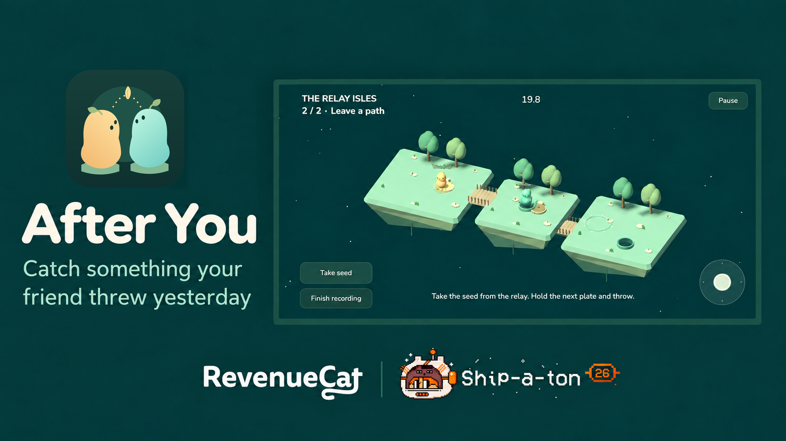
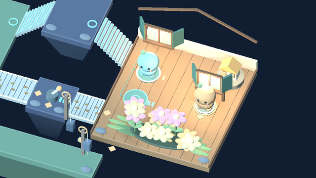
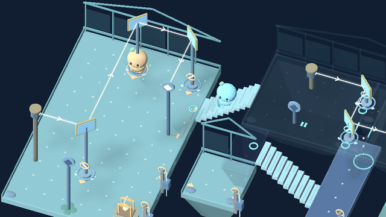
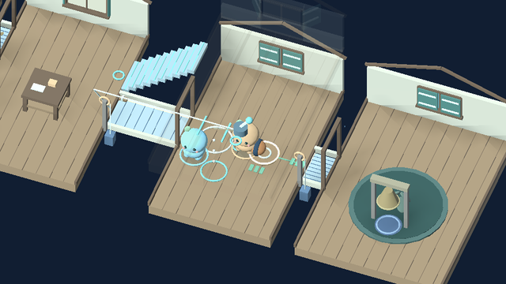
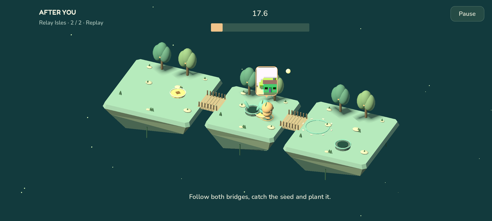

## Shipaton 2026
After You is my submission for RevenueCat's Shipaton 2026. As stressful as it was, working on this app has been a very rewarding experience and I'd do it all over again in a heartbeat.

Check out the [submission on Devpost](https://devpost.com/software/after-you).

# After You

Catch something your friend threw yesterday.

After You is an asynchronous cooperative Android puzzle game. Made for people who live apart but love close together in heart.
After You is a puzzle game for Android that is played by two people at different times. Record your character's movements in a floating world and save the turn. Your friend comes back later and plays next to your recorded spirit. An internet connection is required during each online turn.

  
   
  
  

Long Way Home · Conservatory · A House for Two

Desktop level previews.

## Play
Download After You from Google Play:
https://play.google.com/store/apps/details?id=com.aamirazeez.afteryou

Download the tester APK and its SHA-256 checksum from GitHub:
https://github.com/aamir-azeez/after-you/releases

The free chapters are available in the GitHub tester APK. Invited testers can use a tester code to gain access to paid content. Purchase the one-time Full Journey unlock from the Google Play version.

After You runs on Android 7.0 and later. Players must have the app to play online.

### Find your first island

Select Find your first island, then First Steps · Solo to learn both parts. Use the thumbstick to move and the action button for actions that are close by. Record your character's movements, watch the replay and save the turn. The next spirit plays with that recording. Take your turn according to the timer.

Each shared chapter also has a Together button. You and your friend alternate turns at different times. Your friend can come back later to do the next turn.

### Friends and rooms

Tap on the home screen to choose Friends. Give someone your friend code, or enter the code they gave you. If the request is accepted, you are connected. The host can share the current room. Their friend can enter the room without typing the invitation code.

To join with an invitation code, open Play with a friend and choose Join a chapter. If you want to join an older room, select Join an earlier island. Recent online rooms lists rooms you hosted or joined.

Online status is not required. If you want to, turn off Share online status in Settings. Status may take a while to update and will expire after a lost connection.

### Settings

Choose Low, Balanced or High graphics in Settings. Left-handed controls, forgiving catches, reduced motion, sound and haptics are available. Online status and turn notifications are optional.

Optional photo memories

Once you've saved an online First Steps or Relay Isles contribution, you can add a small photo. Take or retake it, choose Use photo, and then Share photo with this room. Use: saves the picture to your device; Share: sends the picture to your friend. If confirmed, press Done — continue playing. Keep on device & continue saves the photo in app-private storage without uploading. Photos that are saved and downloaded will not expire from the camera cache. Continue without a photo: allows you to skip the photo.

Each contribution keeps its own photo. During a combined replay, the bubble above
each spirit changes to the photo for that person's contribution in the current
stage, including when the recording roles change. If a turn is made without a photo, it has no
bubble. It does not take that person's most recent picture. Shared photos are saved on
your phone for offline replays. The app checks for replacements and removals.
When both phones confirm that they have saved a picture, the server copy is deleted.
Server copies can also be deleted when a photo, room or account is deleted.

On the home screen, shared replays are gathered separately
from **Your replays**. Open a room and select a finished stage to view both
contributions together. Memories that have been previously cached can be viewed offline; opening
an older uncached memory requires a connection.

Go to Settings → Account & recovery → Photo transfer before switching phones. Preparing a transfer uploads up to the newest 1,000 saved photos, including unshared photos, to temporary private account storage. Log in to the same game account on the other phone and select Receive photos. Once the receiving phone has confirmed that it has saved the photo, each server copy is removed. Temporary copies are valid for 14 days and a new transfer can be made every 24 hours. Temporary storage retains up to the newest 1,000 photos. Requests that are interrupted continue their progress. A transfer might not complete if the capacity is reached before all selected photos are uploaded. The app will inform you when to try again and local photos will stay on your phone. Local photos will be removed during reinstallation of the app or when you clear the app data, so please make sure to prepare a transfer in advance.

New captures are square, up to 160 × 160 pixels and 24 KiB. Older photos are still usable. You can open your contribution's photo to share or delete it without altering the recorded turn. Turn off prompts by using Don't ask after each turn or disable Ask me about adding a photo after each shared turn in Settings.

Shared photo memory on an Android emulator, with the virtual camera.

The Android robot in the virtual-camera image is artwork by Google, reproduced
under the [Creative Commons Attribution 3.0 license](https://creativecommons.org/licenses/by/3.0/).
See [Android's attribution guidelines](https://developer.android.com/distribute/marketing-tools/brand-guidelines).
Android is a trademark of Google LLC.

### Access, purchases and multiplayer

Google Play builds are powered by Google Play Billing via RevenueCat.

An access code is available for invited testers to redeem under **Settings → Tester code**.
Redeemed access is still available offline. After the same game account is recovered
on another device, select Restore tester access.

When open, waiting rooms check for updates about every 3 seconds. Refresh can be done manually, and if there are connection failures, the checks will be less frequent. Turn notifications are optional in configured Android builds, under Settings → Notifications. Android permission and connection are required for notification delivery. Manual refresh is still available. Opening a notification checks the shared room and leaves any unfinished rehearsal intact before switching rooms. Rooms that have been completed on the other islands have pre-programmed reaction messages. Preset messages are not yet available in First Steps and Relay Isles, but optional turn photos are supported. The Sleeping Lighthouse is solo.

## Tech stack

| Layer | Technology | Role |
| --- | --- | --- |
| Game | **Godot 4.7.2**, GDScript, Compatibility renderer | Native 3D scenes, touch controls, animation and a deterministic 30 Hz puzzle simulation. |
| Android integration | **Kotlin 2.1.20**, custom Godot plugin | Camera capture, haptics, notifications and secure device storage. |
| Purchases | **RevenueCat Android SDK 10.15.1**, Google Play Billing 8.3.0 | Full Journey offerings, one-time purchase, restore and entitlement updates. The backend checks premium hosting access. |
| Backend | **Cloudflare Workers**, TypeScript 5.9.3 | HTTPS JSON API for anonymous accounts, invitations, turn submissions and synchronization. |
| Server storage | **SQLite-backed Durable Objects** | Persistent player and room state, recording receipts, photo delivery, temporary photo transfers and safety controls. |
| Push notifications | **Firebase Cloud Messaging 25.1.3** | The Worker sends turn alerts through FCM's HTTP v1 API; the Android plugin opens the relevant room. |
| On-device storage | **JSON saves, JPEG files, Android Keystore** | Local drafts, replays and photo caches; device credentials are encrypted with AES-GCM using a Keystore key. |
| Build tooling | **JDK 17**, Gradle 8.11.1, Android Gradle Plugin 8.9.2, PowerShell, Wrangler 4.131.2 | Android packaging and Worker development. Android compiles and targets API 36, with API 24 as the minimum. |
| Verification | **Godot headless tests, Vitest 4.1.11, JUnit, GitHub Actions** | Simulation and save tests, backend tests in the Workers runtime, native plugin tests and continuous integration. |
| Art and sound | **Godot 3D meshes, original sound effects, Fredoka and Nunito fonts** | Floating islands, spirit characters, sound effects and interface typography. |

The Android app runs the puzzle simulation locally and exchanges compact recordings
with the Worker. A Durable Object stores each room's state and coordinates turns.
RevenueCat handles purchase state, while FCM delivers turn notifications when the
other player is away. Saved recordings and downloaded photos can be replayed offline.

Dependency versions are pinned in the [Android build](native/plugin/build.gradle.kts),
[Gradle lockfile](native/plugin/gradle.lockfile) and
[backend package manifest](backend/package.json).

## Development

Open `game/project.godot` in **Godot 4.7.2 stable** to run the game on desktop.
Android builds use JDK 17, SDK 36 and the native RevenueCat plugin.

- [Android integration and build reference](native/README.md)
- [Backend API and local development](backend/README.md)
- [Automated checks](.github/workflows/verify.yml)

## How it works

- `game/core` owns the 30 Hz integer simulation, versioned islands and replay validation.
- `game/presentation` owns 3D scenery, animation and touch controls.
- `game/services` owns durable local saves, purchase integration, encrypted identity
  access and room transport.
- `native` wraps the official RevenueCat Android SDK and Android Keystore.
- `backend` uses Cloudflare Workers and SQLite Durable Objects for players, rooms,
  private photo transfers and a shared transfer-admission ledger.

Recordings contain compact actions and state checkpoints, not screen video.
Critical puzzle objects use scripted trajectories rather than unrestricted physics.
Earlier contributions are immutable; a new attempt invalidates dependent later turns.
Read [the core guide](game/core/README.md) before changing recording or simulation versions.

Online identities are anonymous. Invitation codes admit a friend to a room; recovery
codes recover the identity and must be kept private. Device credentials stay in
encrypted, non-backed-up Android storage. Identity deletion removes associated shared
rooms for both participants. It does not refund a store purchase. Local solo progress
remains on the device.

Drafts and pending submissions are saved before network requests. An uncertain request
keeps its exact body and idempotency key until a receipt is reconciled. Conflicting
recordings are preserved for review instead of silently overwriting the partner's turn.

## License

Application source is available under the [MIT license](LICENSE). External libraries,
fonts and other attributed assets retain their own licenses; retain those notices
when redistributing the app.

The original scenery and sound effects are covered by the same MIT license.
The bundled Fredoka and Nunito fonts retain their OFL
licenses. **Settings → Licenses** contains the engine, font and library notices
and is available offline.
