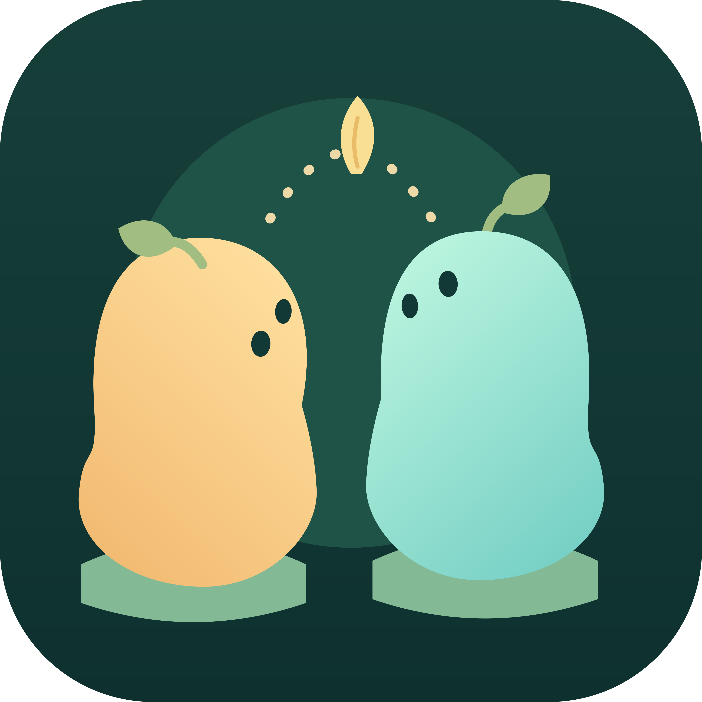
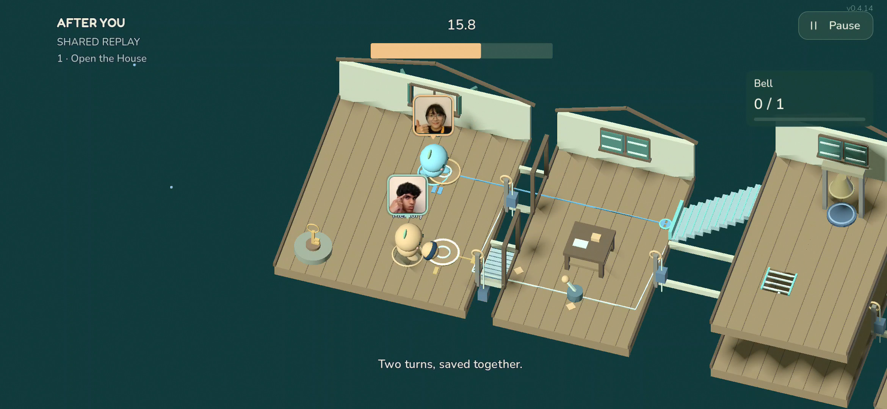
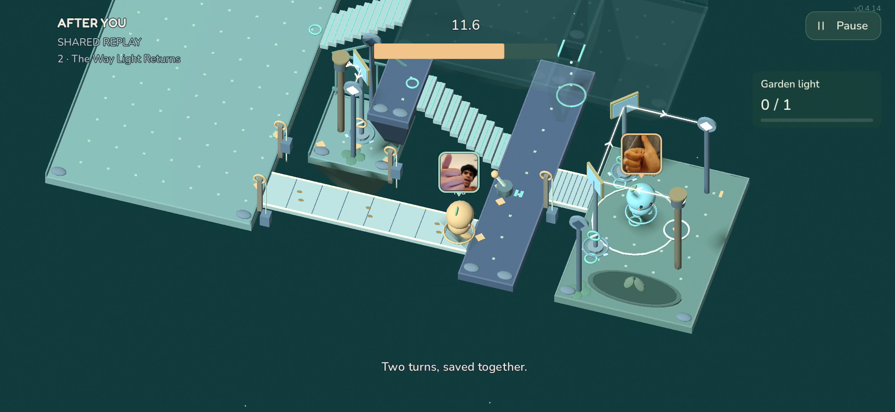

<h1 align="center">After You</h1>

<h3 align="center">Catch something your friend threw yesterday</h3>

 After You is an Android puzzle game for friends who are free at different times. 

  

  <a href="https://www.youtube.com/watch?v=h13yWv7W2FE">Watch the demo</a> ·
  <a href="https://aamirazeez.com/after-you">Website</a> ·
  <a href="https://github.com/aamir-azeez/after-you/releases/tag/v0.4.15">GitHub APKs</a> ·
  <a href="https://devpost.com/software/after-you">Devpost</a>

## Made for Shipaton 2026

After You is my submission for RevenueCat's Shipaton 2026. As stressful as it was, working on this app has been a very rewarding experience and I'd do it all over again in a heartbeat.

[Shipaton 2026](https://www.shipaton.com/) · [RevenueCat](https://www.revenuecat.com/) · [View the submission](https://devpost.com/software/after-you)

  
   After You × RevenueCat Shipaton 2026 · Gameplay composite

## A little time together

After You is not meant to supplant real life relationships. It's meant to supplement them, which is why the timers are so short. You play your couple seconds to let your friends know you care and you put your phone down.

  
   A House for Two · Shared replay

The small turns allow for a puzzle to continue between visits. One person can plan a route, leave a helpful action behind and come back to see what their friend did with it. With Solo, you can experience both sides of that exchange without waiting for anyone else.

## More than just puzzles

| Extra Feature | Description |
| --- | --- |
| Shared replays | Observe how it comes together. Shared replays allow you to view both turns at once, or view all completed sections of a room in sequence. Replays and downloaded photos can be viewed offline on the device where they are saved. The replay handoffs are taken care of by the server, so both players don't need to be online to download their replay. |
| Photo memories | You can optionally see a picture above your spirit in a shared replay. You can skip the photo, turn off future prompts, or come back later to add or edit a photo without changing the recorded turn. |
| Keepsakes | A keepsake is added to the home island when a stage is completed. You can collect Solo and With a friend versions, and browse them from the home screen.|

  
   Conservatory · Shared replay

## Finding the simpler way

The UI went through so many changes. I had to delete and remake these screenshots so many times. I really like the latest revamp of the friends and hosting menus, they seem very well polished to me now. The navigation was changed so much too. I tested the app with my friends and almost every time I found out that _something_ could have been done or shown in a simpler way.

<strong>Friends & rooms</strong>

Make a chapter room and post the invitation so your friend can take the next turn when they come back. Friend codes can also be traded. Once connected, the host can share the current room with their friends, who can join from the Friends screen. The current room is shared with all of the host's connected friends, not just one person.

## Try it

Start free with First Steps, The Relay Isles and High and Low. Full Journey is a one-time purchase in the Google Play version. It includes Sleeping Lighthouse, Rolling Home, A House for Two, Conservatory and Long Way Home. The earlier islands are also still available.

If the chapter is a shared Full Journey chapter, then only the host requires the unlock. Your friend can join without purchasing it. Players must have the app, online rooms must have an internet connection. After You runs on Android 7.0 and later.

<strong>GitHub demo & tester builds</strong>

A RevenueCat Test Store APK is included in the GitHub release. You can make a trial purchase without using real money. This build includes premium solo play for test purchases. Invited tester access is still required to host premium online rooms. Test purchases are not transferred to Google Play.

[Download the Test Store APK](https://github.com/aamir-azeez/after-you/releases/download/v0.4.15/After-You-v0.4.15-RevenueCat-Test-Store.apk) · [All APKs & checksums](https://github.com/aamir-azeez/after-you/releases/tag/v0.4.15)

## Under the islands

The game, scenery and puzzle simulation are run by Godot and GDScript. Kotlin connects the Android app to the camera, haptics, secure storage, notifications and RevenueCat. Accounts and turn exchanges are processed by TypeScript on Cloudflare Workers, while player and room state are stored in Durable Objects using SQLite. RevenueCat manages purchases, and Firebase Cloud Messaging provides optional turn notifications.

Replays do not record video of the screen, but rather actions and state checkpoints. The puzzle simulation is executed locally, the server manages shared rooms and sends recordings.

| Part | Built with |
| --- | --- |
| Game & scenery | Godot · GDScript |
| Android integrations | Kotlin |
| Purchases | RevenueCat · Google Play Billing |
| Online service | TypeScript · Cloudflare Workers |
| Player & room state | SQLite-backed Durable Objects |
| Turn notifications | Firebase Cloud Messaging |

To play the game on desktop, launch game/project.godot in Godot 4.7.2. The current guides include Android builds, backend setup and the recording format.

[Android & builds](native/README.md) · [Backend & API](backend/README.md) · [Simulation & replays](game/core/README.md) · [CI](.github/workflows/verify.yml)

Application source is available under the [MIT license](LICENSE). External libraries,
fonts and other attributed assets retain their own licenses; retain those notices
when redistributing the app.
